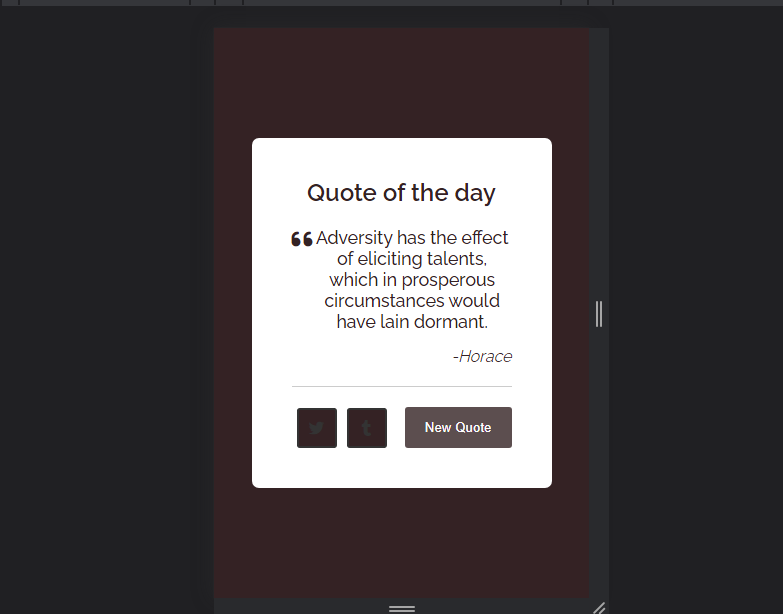
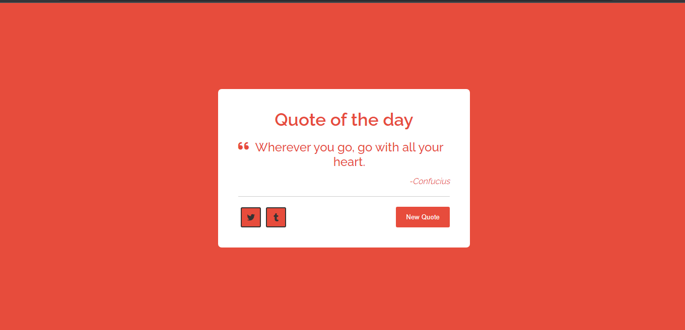

# Random Quote Generator

This project was inspired by freecodecamp. Frontend development libraries project.

## Table of contents

- [Overview](#overview)
  - [The challenge](#the-challenge)
  - [Screenshot](#screenshot)
  - [Links](#links)
  - [Useful Resources](#useful-resources)
- [Author](#author)

## Overview

 Random Quote Generator

### The Challenge

 Users should be able to:

- View the optimal layout for the site depending on their device's screen size
- See hover states for all interactive elements on the page
- Tweet the quote
- Share the quote on tumblr
- Generate a new tweet by clicking the "New Quote" button
- Change the background of the quote-box, buttons and html body by clicking the "New Quote" button

### Screenshot

### Links

- Solution URL: [Git repo url](https://github.com/Plut0r/Random-Quote-Generator)
- Live Site URL: [Git live url](https://plut0r-quote-generator.netlify.app/)

### Useful Resources

- [Youtube video](https://www.youtube.com/c/CodingNepal) 
- [Freecodecamp example link](https://codepen.io/freeCodeCamp/full/qRZeGZ)

## Author

- Gmail - [ogunolaololade@gmail.com](mailto:ogunolaololade@gmail.com)
- Linkedin - [@plut0r](www.linkedin.com/in/plut0r)

